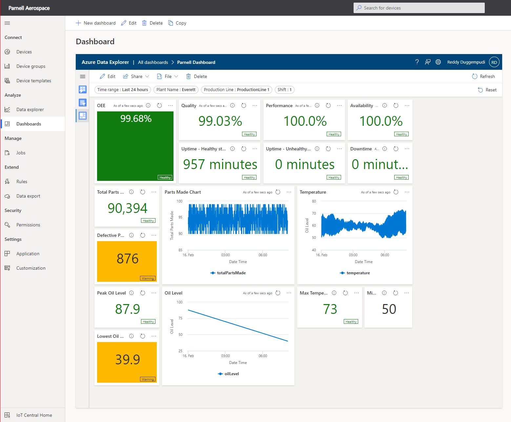
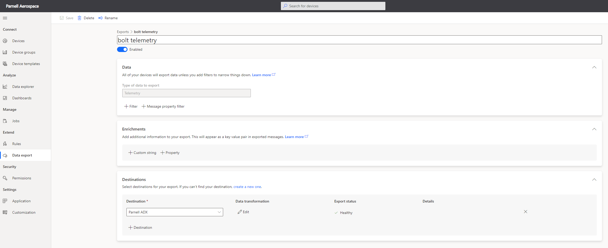
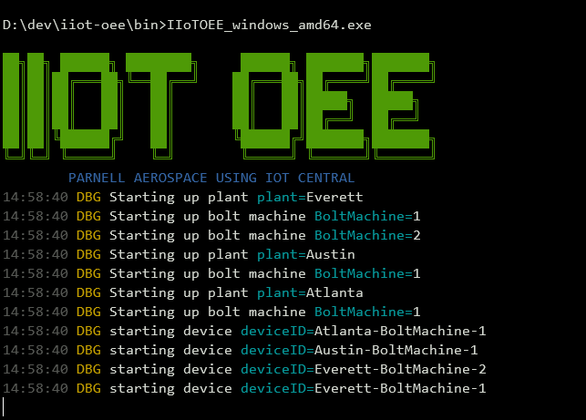

# IIoT OEE
IoT Central sample for calculating Overall Equipment Effectiveness (OEE) of industrial equipment. This application simulates devices sending data to IoT Central. The data can be exported to Azure Data explorer to calculate OEE.



## Contents ##

1. [What is OEE?](https://github.com/iot-for-all/iiot-oee#what-is-oee)
2. [Architecture](https://github.com/iot-for-all/iiot-oee#architecture)
3. [Setting up ADX](https://github.com/iot-for-all/iiot-oee#setting-up-adx)
4. [Setting up IoT Central Application](https://github.com/iot-for-all/iiot-oee#setting-up-iot-central-application)
5. [Creating ADX Dashboard](https://github.com/iot-for-all/iiot-oee#creating-adx-dashboard)
6. [Simulator](https://github.com/iot-for-all/iiot-oee#simulator)


## What is OEE? ##
ADD MORE INFO

## Architecture ##
ADD MORE INFO


## Setting up ADX ##
1. Create an Azure Data Explorer cluster.
2. Create a new database in this cluster.
3. Create a `boltmaker` table in this database. Schema can be found in the [boltmaker](setup/ADXDatabase.kql) file.

## Setting up IoT Central Application ##
1. Create an IoT Central application.
2. Import the [Boltmaker](setup/BoltMaker.json) device template.
3. Set up a new Continuous Data Export of all data coming from Boltmaker devices into ADX that was created earlier. You can get use the [JQ Transform](setup/CDETransform.jq) that is used below.




More information on setting up data export to ADX can be found [here](https://docs.microsoft.com/en-us/azure/iot-central/core/howto-export-data?tabs=data-explorer%2Cjavascript%2Cservice-principal).

## Creating ADX Dashboard ##
Now that the ADX Database and the CDE exports are setup, you can setup the ADX dashbaord using the exported [dashboard](setup/ADXDashboard.json) file. Make sure that you change the datasource ID in the file to your ADX datasource. Feel free to create your own dashboard by looking at the sample queries in this file.

## Simulator ##
You can [download binaries](https://github.com/iot-for-all/iiot-oee/releases) and run them as is, skip to [running simulator](https://github.com/iot-for-all/iiot-oee#running-simulator) section below.

If you want build the binaries yourself, you need to setup the development environment as follows.
### Golang ###
Follow the instructions to [install Go](https://golang.org/doc/install). Pick the appropriate package to install the
latest 1.17.x release of Go. This will give you access to the Go toolchain and compiler.

- If you are on Windows, use the MSI to install. It will set the necessary environment variables.
- If you installed via the tarball, you will need to add a GOROOT environment variable pointing to the
  folder where you installed Go (typically /usr/local/go on linux-based systems)
- You should also check to make sure that you can access the Go compiler and tools. They are available at $GOROOT/bin
  (or $GOROOT\bin) and should be added to your path if they are not already. You can verify this by running the following:
    - Max/Linux: `which go`
    - Windows (CMD): `where go`


### Build ###
Golang produces OS specific executables. You can create a binary targeting any OS from any OS.

To build starling, you can use the makefile. Help can be displayed by running `make help`.
```
$ make help
all                            Build for all platforms
build                          Build binaries for all platforms
clean                          Clean all binaries
build-windows                  Build binary for windows
build-linux                    Build binary for linux
build-darwin                   Build binary for darwin
help                           Display available commands
```

#### Build binaries ####
Use the `make` command to build binaries for all platforms.
use the following commands for building only targeting specific platform:
1. Windows: `make windows` or `GOOS=windows GOARCH=amd64 go build -v -o bin/starling_windows_amd64.exe`
2. Linux: `make linux`
3. Raspberry Pi: `make pi`
4. macOS: `make darwin` 

```
$ make
CGO_ENABLED=0 GOOS=windows GOARCH=amd64 go build -o bin/IIoTOEE_windows_amd64.exe -v
CGO_ENABLED=0 GOOS=linux GOARCH=amd64 go build -o bin/IIoTOEE_unix_amd64 -v
CGO_ENABLED=0 GOOS=darwin GOARCH=amd64 go build -o bin/IIoTOEE_darwin_amd64 -v
```
#### Cleanup ####
To clean up all the binaries, use `make clean`

## Configure ##
Create `iiot.json` file in `$src/bin` folder i.e. where you have your exe file.
```JSON
{
    "logger": {
      "logLevel": "Debug",
      "logsDir": "./logs"
    },
    "application": {
      "provisioningUrl": "global.azure-devices-provisioning.net",
      "idScope": "YOUR_SCOPE_ID",
      "masterKey": "YOUR_APP_DEVICE_ENROLLMENT_GROUP_KEY",
      "boltMachineModelID": "dtmi:parnellAerospace:BoltMakerV1;1"
    },
    "plant": [
      {
        "name": "Everett",
        "boltMachine":{
          "count": 2,
          "format": "json"
        }
      },
      {
        "name": "Austin",
        "boltMachine":{
          "count": 1,
          "format": "json"
        }
      },
      {
        "name": "Atlanta",
        "boltMachine":{
          "count": 1,
          "format": "json"
        }
      }
    ]
  }
```

## Running simulator ##
IIoT OEE simulator has a single executable.

Platform      | Executable
--------------|----------------------------------
Windows       | `IIoTOEE_windows_amd64.exe`
macOS         | `IIoTOEE_darwin_amd64`
Linux         | `IIoTOEE_linux_amd64`

If you build binaries from source, they will be in the `bin` folder.
To start the starling simulation server, run the above executable.

